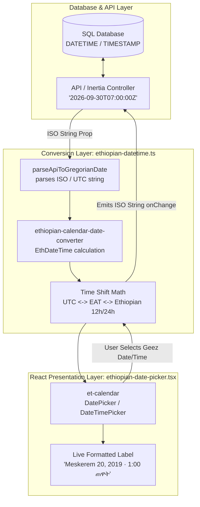

# Ethiopian Calendar & Datetime Picker

This skill guides the implementation of a **dual-calendar Ethiopian date and datetime picker** for modern web applications using **React 18/19**, **TypeScript**, and **Tailwind CSS** (with optional support for **Inertia.js** and **Laravel**).

Under this architecture, the backend and database always store and transfer standard **ISO 8601 UTC dates** (`YYYY-MM-DD` or `YYYY-MM-DDTHH:mm:ssZ`), while the user interface renders, picks, and validates dates in the **Ethiopian calendar** (Geez calendar) and **Ethiopian local clock**.

---

## 1. Architecture Overview

### The Golden Rule
> **Always store standard ISO 8601 (Gregorian / UTC) in the database and API. Only translate to and from the Ethiopian calendar on the presentation layer.**

Storing raw Ethiopian date strings in a database causes:
- Broken SQL range indexing (`WHERE scheduled_at BETWEEN ... AND ...`).
- Inability to use native database date math, grouping by week/month/quarter, or timezone conversions.
- Failure of backend date validation rules in frameworks like Laravel, Node, Rails, or Django.

By converting on the client:
1. The database remains standard and fully indexable.
2. The user interacts exclusively with Ethiopian months (Meskerem–Pagume) and Ethiopian time (starting at 6:00 AM EAT).
3. The component emits clean ISO strings directly to forms.

### Architecture Diagram



---

## 2. Prerequisites & Dependencies

Install the core picker library, the conversion package, and utility helpers:

```bash
npm install et-calendar ethiopian-calendar-date-converter clsx tailwind-merge
```

### Peer Dependencies
- **React**: `^18.0.0` or `^19.0.0`
- **lucide-react**: (bundled dependency of `et-calendar` for calendar navigation icons)
- **Tailwind CSS**: v3 or v4

---

## 3. Ethiopian Datetime Utility Library

Create this utility module at `resources/js/lib/ethiopian-datetime.ts` (or `src/lib/ethiopian-datetime.ts`).

It provides:
- Lossless translation between Gregorian `Date` / ISO strings and Ethiopian `EthDateTime`.
- Precise mathematical conversions for Ethiopian daytime hours (East Africa Time UTC+3 with a 6-hour daylight offset).
- First-class bilingual formatting in English and Amharic.

```typescript
import { EthDateTime } from 'ethiopian-calendar-date-converter';

export type EthiopianLocale = 'en' | 'am';

const MONTH_NAMES_EN: Record<number, string> = {
  1: 'Meskerem',
  2: 'Tikimt',
  3: 'Hidar',
  4: 'Tahsas',
  5: 'Tir',
  6: 'Yekatit',
  7: 'Megabit',
  8: 'Meyazya',
  9: 'Ginbot',
  10: 'Sene',
  11: 'Hamle',
  12: 'Nehase',
  13: 'Pagume',
};

const MONTH_NAMES_AM: Record<number, string> = {
  1: 'መስከረም',
  2: 'ጥቅምት',
  3: 'ኅዳር',
  4: 'ታኅሣሥ',
  5: 'ጥር',
  6: 'የካቲት',
  7: 'መጋቢት',
  8: 'ሚያዝያ',
  9: 'ግንቦት',
  10: 'ሰኔ',
  11: 'ሐምሌ',
  12: 'ነሐሴ',
  13: 'ጳጉሜ',
};

function pad(value: number): string {
  return String(value).padStart(2, '0');
}

function monthName(month: number, locale: EthiopianLocale): string {
  return locale === 'am' ? MONTH_NAMES_AM[month] : MONTH_NAMES_EN[month];
}

/**
 * Convert UTC hour (0–23) to Ethiopian clock hour (0–23).
 * In Ethiopia (UTC+3 / EAT), the daytime 12-hour cycle begins at 6:00 AM EAT.
 * Therefore:
 *   04:00 UTC = 07:00 EAT = 01:00 Ethiopian morning
 */
export function utcToEthiopianHour24(utcHour: number): number {
  return (utcHour - 3 + 24) % 24;
}

/**
 * Convert Ethiopian clock hour (0–23) back to UTC hour (0–23).
 */
export function ethiopianHour24ToUtc(ethHour24: number): number {
  return (ethHour24 + 3) % 24;
}

/**
 * Safely parse an ISO date or datetime string into a Gregorian Date object.
 */
export function parseApiToGregorianDate(value: string | null | undefined): Date | null {
  if (!value) {
    return null;
  }

  const trimmed = value.trim();
  if (!trimmed) {
    return null;
  }

  // Matches YYYY-MM-DDTHH:mm or YYYY-MM-DDTHH:mm:ss
  if (/^\d{4}-\d{2}-\d{2}T\d{2}:\d{2}(:\d{2})?$/.test(trimmed)) {
    const normalized = trimmed.length === 16 ? `${trimmed}:00` : trimmed;
    const parsed = new Date(`${normalized}Z`);
    return Number.isNaN(parsed.getTime()) ? null : parsed;
  }

  // Matches YYYY-MM-DD
  if (/^\d{4}-\d{2}-\d{2}$/.test(trimmed)) {
    const parsed = new Date(`${trimmed}T00:00:00Z`);
    return Number.isNaN(parsed.getTime()) ? null : parsed;
  }

  const parsed = new Date(trimmed);
  if (Number.isNaN(parsed.getTime())) {
    const withUtc = new Date(`${trimmed.replace(' at ', ' ')} UTC`);
    return Number.isNaN(withUtc.getTime()) ? null : withUtc;
  }

  if (!/[zZ]|[+-]\d{2}:\d{2}$/.test(trimmed)) {
    const asUtc = new Date(`${trimmed}Z`);
    if (!Number.isNaN(asUtc.getTime())) {
      return asUtc;
    }
  }

  return parsed;
}

/**
 * Parse an API date string into an EthDateTime object.
 */
export function parseApiToEthDateTime(value: string | null | undefined): EthDateTime | null {
  const gregorian = parseApiToGregorianDate(value);
  if (!gregorian) {
    return null;
  }

  const eth = EthDateTime.fromEuropeanDate(gregorian);
  return new EthDateTime(
    eth.year,
    eth.month,
    eth.date,
    utcToEthiopianHour24(gregorian.getUTCHours()),
    gregorian.getUTCMinutes(),
    gregorian.getUTCSeconds(),
  );
}

/**
 * Format a Date object into Ethiopian 12-hour clock format.
 * Example: 7:00 AM EAT -> "1:00 a.m." (en) or "1:00 ጠዋት" (am)
 */
export function formatEthTimeFromUtcDate(date: Date, locale: EthiopianLocale = 'en'): string {
  const ethHour24 = utcToEthiopianHour24(date.getUTCHours());
  const hour12 = ethHour24 === 0 ? 12 : ethHour24 > 12 ? ethHour24 - 12 : ethHour24;
  const period =
    locale === 'am'
      ? ethHour24 < 12
        ? 'ጠዋት'
        : 'ከሰዓት'
      : ethHour24 < 12
        ? 'a.m.'
        : 'p.m.';

  return `${hour12}:${pad(date.getUTCMinutes())} ${period}`;
}

/**
 * Format an API date string into Ethiopian date format.
 * Example: "Meskerem 20, 2019" (en) or "መስከረም 20, 2019" (am)
 */
export function formatEthDate(value: string | null | undefined, locale: EthiopianLocale = 'en'): string {
  const eth = parseApiToEthDateTime(value);
  if (!eth) {
    return value ?? '';
  }

  return `${monthName(eth.month, locale)} ${eth.date}, ${eth.year}`;
}

/**
 * Format the time portion of an API datetime string into Ethiopian time.
 */
export function formatEthTime(value: string | null | undefined, locale: EthiopianLocale = 'en'): string {
  const gregorian = parseApiToGregorianDate(value);
  if (!gregorian) {
    return value ?? '';
  }

  return formatEthTimeFromUtcDate(gregorian, locale);
}

/**
 * Format an API datetime into full Ethiopian date and time.
 * Example: "Meskerem 20, 2019 · 1:00 a.m." or "መስከረም 20, 2019 · 1:00 ጠዋት"
 */
export function formatEthDateTime(value: string | null | undefined, locale: EthiopianLocale = 'en'): string {
  const eth = parseApiToEthDateTime(value);
  if (!eth) {
    return value ?? '';
  }

  const gregorian = parseApiToGregorianDate(value);
  if (!gregorian) {
    return value ?? '';
  }

  return `${formatEthDate(value, locale)} · ${formatEthTimeFromUtcDate(gregorian, locale)}`;
}

/**
 * Convert an EthDateTime object to a standard Gregorian Date in UTC.
 */
export function ethDateTimeToGregorianDate(eth: EthDateTime): Date {
  const base = eth.toEuropeanDate();
  const utcHour = ethiopianHour24ToUtc(eth.hour);
  return new Date(
    Date.UTC(
      base.getUTCFullYear(),
      base.getUTCMonth(),
      base.getUTCDate(),
      utcHour,
      eth.minute,
      eth.second,
    ),
  );
}

/**
 * Convert an EthDateTime to an ISO 8601 API datetime string (YYYY-MM-DDTHH:mm:ss).
 */
export function ethDateTimeToApiDatetime(eth: EthDateTime): string {
  const gregorian = ethDateTimeToGregorianDate(eth);
  return `${gregorian.getUTCFullYear()}-${pad(gregorian.getUTCMonth() + 1)}-${pad(gregorian.getUTCDate())}T${pad(gregorian.getUTCHours())}:${pad(gregorian.getUTCMinutes())}:${pad(gregorian.getUTCSeconds())}`;
}

/**
 * Get the current Ethiopian date and time.
 */
export function todayEth(): EthDateTime {
  return EthDateTime.now();
}

/**
 * Convert an EthDateTime to an API date string (YYYY-MM-DD).
 */
export function ethDateToApiDate(eth: EthDateTime): string {
  const gregorian = eth.toEuropeanDate();
  return `${gregorian.getUTCFullYear()}-${pad(gregorian.getUTCMonth() + 1)}-${pad(gregorian.getUTCDate())}`;
}

/**
 * Convert a Gregorian Date instant to an API datetime string (YYYY-MM-DDTHH:mm:ss).
 */
export function gregorianInstantToApiDatetime(date: Date): string {
  return `${date.getUTCFullYear()}-${pad(date.getUTCMonth() + 1)}-${pad(date.getUTCDate())}T${pad(date.getUTCHours())}:${pad(date.getUTCMinutes())}:${pad(date.getUTCSeconds())}`;
}

/**
 * Convert a Gregorian Date instant to an API date string (YYYY-MM-DD).
 */
export function gregorianInstantToApiDate(date: Date): string {
  return `${date.getUTCFullYear()}-${pad(date.getUTCMonth() + 1)}-${pad(date.getUTCDate())}`;
}
```

---

## 4. React Picker Components

Create the UI component at `resources/js/components/ethiopian-date-picker.tsx` (or `src/components/ethiopian-date-picker.tsx`).

It exposes two controlled components:
1. `EthiopianDatePickerField`: for date-only values (`YYYY-MM-DD`).
2. `EthiopianDateTimePickerField`: for date + time values (`YYYY-MM-DDTHH:mm:ss`).

Both components:
- Receive a standard ISO string `value`.
- Emit standard ISO strings via `onChange(value: string)`.
- Render an input trigger button opening the Geez calendar popup.
- Show an interactive preview label underneath confirming the selected Ethiopian date/time in the user's language.

```tsx
import { DatePicker, DateTimePicker } from 'et-calendar';
import { clsx, type ClassValue } from 'clsx';
import { twMerge } from 'tailwind-merge';

import {
  formatEthDate,
  formatEthDateTime,
  gregorianInstantToApiDate,
  gregorianInstantToApiDatetime,
  parseApiToGregorianDate,
  type EthiopianLocale,
} from '@/lib/ethiopian-datetime';

function cn(...inputs: ClassValue[]) {
  return twMerge(clsx(inputs));
}

export type EthiopianDatePickerProps = {
  value: string;
  onChange: (value: string) => void;
  className?: string;
  placeholder?: string;
  locale?: EthiopianLocale;
};

export type EthiopianDateTimePickerProps = EthiopianDatePickerProps;

const pickerClassNames = {
  container: 'w-full',
  triggerButton: cn(
    'flex h-10 w-full items-center justify-between rounded-lg border border-stone-300 bg-white px-3 text-sm text-stone-900 shadow-sm transition hover:bg-stone-50 focus:outline-none focus:ring-2 focus:ring-stone-400',
  ),
  formattedDate: 'text-left text-sm text-stone-900',
  placeholder: 'text-stone-400',
  popoverPanel: 'z-50 rounded-lg border border-stone-200 bg-white p-2 shadow-xl',
};

const dateTimePickerClassNames = {
  container: '!flex !w-full !min-w-0 !rounded-lg !border !border-stone-300 !bg-white !p-1 shadow-sm',
  triggerButton:
    '!flex !min-w-0 !flex-1 !items-center !gap-1 !border-0 !bg-transparent !px-2 !py-1.5 !text-sm !text-stone-900 !shadow-none hover:!bg-stone-50',
  formattedDate: 'min-w-0 truncate text-left text-sm text-stone-900',
  placeholder: 'text-stone-400',
  icon: '!size-4 !shrink-0 text-stone-500',
  popoverPanel: 'z-50 rounded-lg border border-stone-200 bg-white p-2 shadow-xl',
};

const dateTimeTimePickerClassNames = {
  triggerButton:
    '!flex !min-w-0 !flex-1 !items-center !gap-1 !border-0 !bg-transparent !px-2 !py-1.5 !text-sm !text-stone-900 !shadow-none hover:!bg-stone-50',
  timeDisplay: 'min-w-0 truncate text-sm font-medium',
  icon: '!size-4 !shrink-0 text-stone-500',
  placeholder: 'text-stone-400',
};

const calendarClassNames = {
  dayButton: 'rounded-md hover:bg-stone-100 transition-colors',
  selected: 'bg-stone-900 text-white font-medium hover:bg-stone-800',
  today: 'border border-stone-400 font-semibold',
};

/**
 * Date-only picker (outputs YYYY-MM-DD)
 */
export function EthiopianDatePickerField({
  value,
  onChange,
  className,
  placeholder = 'Select date',
  locale = 'en',
}: EthiopianDatePickerProps) {
  const selectedDate = parseApiToGregorianDate(value) ?? undefined;

  return (
    <div className={className}>
      <DatePicker
        selectedDate={selectedDate}
        onDateChange={(date) => onChange(gregorianInstantToApiDate(date))}
        showCalendars="ethiopian"
        viewFirst="Ethiopian"
        closeOnSelect
        datePickerClassNames={{
          ...pickerClassNames,
          formattedDate: value ? pickerClassNames.formattedDate : pickerClassNames.placeholder,
        }}
        calanderClassNames={calendarClassNames}
      />
      <p className="mt-1 text-xs text-stone-500">
        {value ? formatEthDate(value, locale) : placeholder}
      </p>
    </div>
  );
}

/**
 * Date and time picker (outputs YYYY-MM-DDTHH:mm:ss)
 */
export function EthiopianDateTimePickerField({
  value,
  onChange,
  className,
  placeholder = 'Select date and time',
  locale = 'en',
}: EthiopianDateTimePickerProps) {
  const selectedDate = parseApiToGregorianDate(value) ?? undefined;

  return (
    <div className={className}>
      <DateTimePicker
        selectedDate={selectedDate}
        onDateChange={(date) => onChange(gregorianInstantToApiDatetime(date))}
        showCalendars="ethiopian"
        viewFirst="Ethiopian"
        timeFormat="12h"
        closeOnSelect
        datePickerClassNames={{
          ...dateTimePickerClassNames,
          formattedDate: value
            ? dateTimePickerClassNames.formattedDate
            : dateTimePickerClassNames.placeholder,
        }}
        timePickerClassNames={dateTimeTimePickerClassNames}
        calanderClassNames={calendarClassNames}
      />
      <p className="mt-1 text-xs text-stone-500">
        {value ? formatEthDateTime(value, locale) : placeholder}
      </p>
    </div>
  );
}
```

---

## 5. Integration Recipes

### Recipe A: Inertia.js Form (`useForm`)

Ideal for standard create/edit pages:

```tsx
import { useForm } from '@inertiajs/react';
import { EthiopianDateTimePickerField } from '@/components/ethiopian-date-picker';

export default function CreateOrder() {
  const form = useForm({
    customer_name: '',
    scheduled_at: '', // Stores ISO string e.g. "2026-09-30T10:00:00"
  });

  const submit = (e: React.FormEvent) => {
    e.preventDefault();
    form.post('/admin/orders');
  };

  return (
    <form onSubmit={submit} className="space-y-4 max-w-md">
      <div>
        <label className="block text-sm font-medium text-stone-700">Customer Name</label>
        <input
          type="text"
          value={form.data.customer_name}
          onChange={(e) => form.setData('customer_name', e.target.value)}
          className="mt-1 block w-full rounded-md border border-stone-300 px-3 py-2 text-sm"
        />
        {form.errors.customer_name && (
          <p className="mt-1 text-xs text-rose-500">{form.errors.customer_name}</p>
        )}
      </div>

      <div>
        <label className="block text-sm font-medium text-stone-700">Scheduled Date & Time</label>
        <EthiopianDateTimePickerField
          value={form.data.scheduled_at}
          onChange={(value) => form.setData('scheduled_at', value)}
          locale="am" // Set to 'am' for Amharic or 'en' for English
          className="mt-1"
        />
        {form.errors.scheduled_at && (
          <p className="mt-1 text-xs text-rose-500">{form.errors.scheduled_at}</p>
        )}
      </div>

      <button
        type="submit"
        disabled={form.processing}
        className="rounded bg-stone-900 px-4 py-2 text-sm text-white"
      >
        Save Order
      </button>
    </form>
  );
}
```

---

### Recipe B: Plain React Form (`useState`)

For React SPAs without Inertia:

```tsx
import { useState } from 'react';
import { EthiopianDatePickerField } from '@/components/ethiopian-date-picker';

export function AppointmentBooking() {
  const [appointmentDate, setAppointmentDate] = useState('2026-09-30');

  return (
    <div className="p-4">
      <label className="block text-sm font-medium text-stone-700">Appointment Date</label>
      <EthiopianDatePickerField
        value={appointmentDate}
        onChange={setAppointmentDate}
        locale="en"
        className="mt-1 max-w-xs"
      />
      <div className="mt-2 text-xs text-stone-600">
        Raw API Value: <code>{appointmentDate}</code>
      </div>
    </div>
  );
}
```

---

### Recipe C: Filter Bar & Date Presets

For reports, analytics, or table filtering:

```tsx
import { useState } from 'react';
import { EthiopianDatePickerField } from '@/components/ethiopian-date-picker';
import { todayEth, ethDateToApiDate, parseApiToGregorianDate } from '@/lib/ethiopian-datetime';

export function ReportDateFilters({ onFilter }: { onFilter: (from: string, to: string) => void }) {
  const [from, setFrom] = useState('');
  const [to, setTo] = useState('');

  const applyPreset = (preset: 'today' | 'last7' | 'month') => {
    const todayApi = ethDateToApiDate(todayEth());
    const gregorianToday = parseApiToGregorianDate(todayApi) ?? new Date();

    if (preset === 'today') {
      setFrom(todayApi);
      setTo(todayApi);
      onFilter(todayApi, todayApi);
      return;
    }

    if (preset === 'last7') {
      const past = new Date(gregorianToday);
      past.setUTCDate(past.getUTCDate() - 6);
      const pastApi = past.toISOString().slice(0, 10);
      setFrom(pastApi);
      setTo(todayApi);
      onFilter(pastApi, todayApi);
      return;
    }
  };

  return (
    <div className="flex flex-wrap items-center gap-3">
      <button
        type="button"
        onClick={() => applyPreset('today')}
        className="rounded border border-stone-300 bg-white px-3 py-1.5 text-xs font-medium"
      >
        Today
      </button>
      <button
        type="button"
        onClick={() => applyPreset('last7')}
        className="rounded border border-stone-300 bg-white px-3 py-1.5 text-xs font-medium"
      >
        Last 7 Days
      </button>

      <div className="flex items-center gap-2">
        <EthiopianDatePickerField value={from} onChange={setFrom} placeholder="From date" />
        <span className="text-stone-400">to</span>
        <EthiopianDatePickerField value={to} onChange={setTo} placeholder="To date" />
      </div>
    </div>
  );
}
```

---

### Recipe D: Read-Only Presentation in Tables / Cards

To format database timestamps into Ethiopian calendar strings throughout the app:

```tsx
import { formatEthDate, formatEthDateTime } from '@/lib/ethiopian-datetime';

type OrderRowProps = {
  order: {
    id: number;
    code: string;
    created_at: string; // ISO string from database
    scheduled_at: string;
  };
  locale: 'en' | 'am';
};

export function OrderRow({ order, locale }: OrderRowProps) {
  return (
    <tr className="border-b border-stone-200">
      <td className="px-4 py-2 font-mono text-sm">{order.code}</td>
      {/* Date only: "Meskerem 20, 2019" or "መስከረም 20, 2019" */}
      <td className="px-4 py-2 text-sm text-stone-600">
        {formatEthDate(order.created_at, locale)}
      </td>
      {/* Full date & time: "Meskerem 20, 2019 · 1:00 a.m." or "መስከረም 20, 2019 · 1:00 ጠዋት" */}
      <td className="px-4 py-2 text-sm text-stone-900 font-medium">
        {formatEthDateTime(order.scheduled_at, locale)}
      </td>
    </tr>
  );
}
```

---

## 6. Backend Integration Contract (Laravel)

### Database Migration
Keep all columns as standard SQL `DATETIME` or `DATE`:

```php
Schema::table('orders', function (Blueprint $table) {
    $table->dateTime('scheduled_at')->nullable();
    $table->date('delivery_date')->nullable();
});
```

### Eloquent Model Casting
Cast attributes to `datetime` or `date`:

```php
namespace App\Models;

use Illuminate\Database\Eloquent\Model;

class Order extends Model
{
    protected function casts(): array
    {
        return [
            'scheduled_at' => 'datetime',
            'delivery_date' => 'date',
        ];
    }
}
```

### Form Request Validation
Use standard Laravel `'date'` validation rules:

```php
namespace App\Http\Requests;

use Illuminate\Foundation\Http\FormRequest;

class StoreOrderRequest extends FormRequest
{
    public function rules(): array
    {
        return [
            'scheduled_at' => ['required', 'date'],
            'delivery_date' => ['nullable', 'date'],
        ];
    }
}
```

### Serializing for Inertia / API
Serialize datetimes in standard ISO format for the frontend:

```php
return Inertia::render('Admin/Orders/Show', [
    'order' => [
        'id' => $order->id,
        'scheduled_at' => $order->scheduled_at?->format('Y-m-d\TH:i:s'),
        'scheduled_at_formatted' => $order->scheduled_at?->format('M d, Y \a\t H:i'),
    ],
]);
```

---

## 7. Ethiopian Calendar Primer & Gotchas

### 1. The 13 Months (*Pagume*)
- Months 1–12 have exactly **30 days**.
- Month 13 (**Pagume**) has **5 days** (or **6 days** in a leap year).
- The Ethiopian leap year occurs every 4 years without century exceptions (e.g., 2015 was a leap year with 6 days in Pagume).
- `ethiopian-calendar-date-converter` handles Pagume boundaries automatically.

### 2. The 7 to 8 Year Difference
- From September 11/12 (Meskerem 1) until December 31, the Ethiopian year is **7 years** behind the Gregorian year.
- From January 1 until September 10, the Ethiopian year is **8 years** behind the Gregorian year.

### 3. Ethiopian Daytime Hours & The 6-Hour Shift
- The Ethiopian clock does not divide the day at midnight and noon.
- Instead, the 12-hour day cycle begins at **dawn (6:00 AM EAT)**:
  - 6:00 AM EAT = 12:00 dawn
  - 7:00 AM EAT = 1:00 morning (`1:00 ጠዋት` / `1:00 a.m.`)
  - 12:00 PM EAT = 6:00 midday
  - 6:00 PM EAT = 12:00 dusk
  - 7:00 PM EAT = 1:00 night (`1:00 ከሰዓት` / `1:00 p.m.`)
- When working with UTC:
  - Ethiopia is in East Africa Time (`UTC+3`).
  - Therefore, `04:00 UTC` = `07:00 EAT` = `01:00 Ethiopian Morning`.
  - The utility formula `(utcHour - 3 + 24) % 24` precisely maps UTC hours to Ethiopian clock hours.

### 4. Popover Layering in Modals & Dialogs
- `et-calendar` renders popovers using floating portals or absolute positioning.
- Ensure `popoverPanel` contains `z-50` (or higher) to prevent modal overlays or table overflow wrappers (`overflow-x-auto`) from clipping the calendar dropdown.

---

## 8. Verification & Porting Checklist

When porting this component to a new project, verify the following:

- [ ] **Dependencies installed**: `et-calendar` and `ethiopian-calendar-date-converter` are present in `package.json`.
- [ ] **Utility created**: `ethiopian-datetime.ts` is in your utilities/lib folder.
- [ ] **Component created**: `ethiopian-date-picker.tsx` is placed in components directory.
- [ ] **Imports verified**: Tailwind `cn` helper is correctly imported.
- [ ] **Bilingual preview**: Switching `locale="am"` displays Geez month names (`መስከረም`) and day periods (`ጠዋት`/`ከሰዓት`).
- [ ] **API contract**: Form submission sends ISO `YYYY-MM-DD` or `YYYY-MM-DDTHH:mm:ss`.
- [ ] **Backend acceptance**: Database stores standard `datetime`/`date` without errors.
